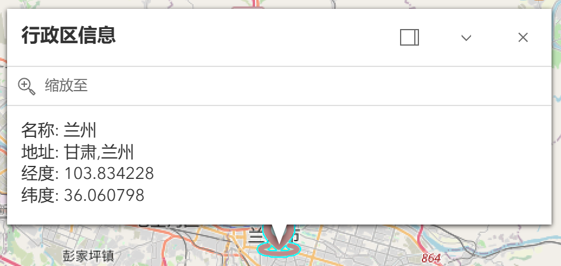
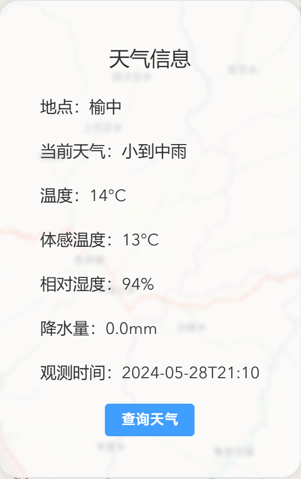
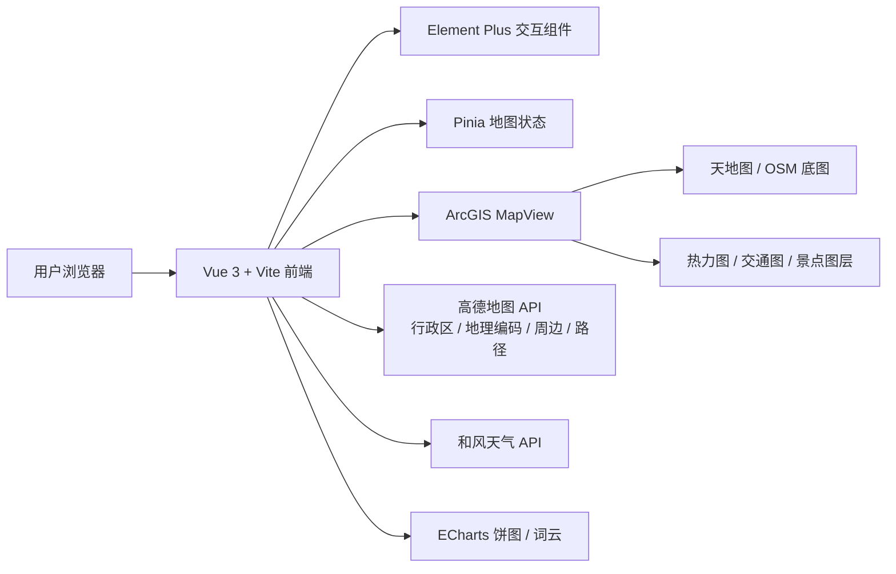

# 青甘大环线智能旅游服务系统

<p align="center">
  <strong>面向青甘大环线自驾与自由行场景的 WebGIS 旅游规划应用</strong>
</p>

<p align="center">
  
  
  
  
  
</p>

<p align="center">
  <a href="https://qg.zenithangle.top/">在线预览</a>
  ·
  <a href="#快速开始">快速开始</a>
  ·
  <a href="#功能特性">功能特性</a>
  ·
  <a href="./README/README_EN.md">English README</a>
  ·
  <a href="https://zenithangle.top/archives/qinghai-gansu-grand-ring-road-tourism-service-system">English Article</a>
</p>

---

## 项目简介

青甘大环线智能旅游服务系统是一个基于 **ArcGIS Maps SDK for JavaScript** 与 **Vue 3** 的 WebGIS 应用，围绕青海、甘肃环线旅行中的“去哪儿、怎么走、周边有什么、天气如何”等核心问题，提供地图浏览、行政区搜索、路线规划、天气查询、周边 POI 检索、专题图层切换与景点数据可视化能力。

项目适合用于：

- 青甘大环线旅游规划、行程辅助与 WebGIS 教学展示；
- 多源地图服务、第三方位置服务 API 与前端可视化的集成示例；
- Vue + ArcGIS Maps SDK + Element Plus 的地图类前端项目参考。

> 如果在线预览不可用，可按下方“快速开始”在本地运行。

## 功能特性

- 🗺️ **多源地图底图**：支持天地图矢量、天地图影像、天地图地形晕染与 OpenStreetMap 底图切换。
- 🔥 **专题图层展示**：内置青甘大环线热力图、交通图层与景点要素图层。
- 🔎 **行政区与坐标搜索**：支持按省 / 市 / 县级行政区搜索，也支持 `纬度,经度` 格式定位。
- 🌦️ **实时天气查询**：基于地图中心点查询附近城市与实时天气信息。
- 🧭 **位置查询与手动选点**：支持浏览器定位，也可在地图上手动选择当前位置。
- 🚗 **驾车路线规划**：输入起点、终点后绘制路径，并接入道路阻塞模型生成避让区域。
- 🏨 **周边 POI 查询**：以当前地图中心为基准检索餐饮、酒店、公交、加油站等周边服务。
- 📊 **景点数据可视化**：点击景点后展示详情，并可查看情感分析饼图与微博文本词云。
- 🧹 **临时图层管理**：支持清空搜索点、路线、周边范围等临时绘制内容。

## 项目截图

| 搜索与行政区信息 | 天气信息 |
| --- | --- |
|  |  |

| 搜索框 | 天气入口 |
| --- | --- |
|  |  |

## 技术栈

| 分类 | 技术 |
| --- | --- |
| 前端框架 | Vue 3、Vite |
| 地图能力 | ArcGIS Maps SDK for JavaScript、天地图、OpenStreetMap |
| UI 组件 | Element Plus、@element-plus/icons-vue |
| 状态管理 | Pinia |
| 数据请求 | Axios、Fetch API |
| 可视化 | ECharts、wordcloud |
| 外部服务 | 高德地图 Web 服务 API、和风天气 API、ArcGIS Server / GeoScene 服务 |

## 系统架构



## 快速开始

### 环境要求

- Node.js `^20.19.0` 或 `>=22.12.0`
- npm 9+（项目已包含 `package-lock.json`，推荐使用 npm 安装依赖）
- 可访问天地图、高德地图、和风天气及项目中配置的 ArcGIS / GeoScene 服务

### 1. 克隆项目

```bash
git clone <your-repository-url>
cd QG_TravelSystem
```

### 2. 安装依赖

```bash
npm install
```

### 3. 配置 API Key

复制环境变量示例并填写允许公开到浏览器的客户端配置：

```bash
cp .env.example .env.local
```

`.env.local` 包含以下字段：

```dotenv
VITE_TIANDITU_KEY=your-public-tianditu-client-key
VITE_AMAP_WEB_SERVICE_KEY=your-public-amap-web-service-key
VITE_QWEATHER_API_KEY=your-public-qweather-api-key
VITE_QWEATHER_API_HOST=https://your-account-api-host.qweatherapi.com
```

字段说明：

| 字段 | 用途 |
| --- | --- |
| `VITE_TIANDITU_KEY` | 天地图 WMTS 底图服务 Key |
| `VITE_AMAP_WEB_SERVICE_KEY` | 高德地图 Web 服务 Key，用于行政区查询、地理编码、周边搜索与驾车路径规划 |
| `VITE_QWEATHER_API_KEY` | 和风天气 API Key，用于城市查询与实时天气查询 |
| `VITE_QWEATHER_API_HOST` | 和风天气控制台分配的专属 API Host，必须使用 `https://*.qweatherapi.com` |

> 本项目是纯浏览器应用，所有 `VITE_` 值都会进入生产 JavaScript，不能视为秘密。高德 Web 服务 Key 也可被复制，浏览器域名白名单不能替代后端保护；请设置供应商实际支持的 API 范围、配额和账单上限。需要保密或不可承受滥用的调用必须放到后端代理。`.env.local` 已被 Git 忽略，更多说明见 [SECURITY.md](./SECURITY.md)。API Host 中不应包含 URL 用户名、密码或其他秘密。

### 4. 启动开发服务

```bash
npm run dev
```

启动后，根据终端输出访问本地开发地址，通常为：

```text
http://localhost:5173/
```

### 5. 构建与预览

```bash
npm run build
npm run preview
```

## 常用脚本

| 命令 | 说明 |
| --- | --- |
| `npm run dev` | 启动 Vite 开发服务器 |
| `npm run build` | 构建生产环境静态资源 |
| `npm run preview` | 本地预览生产构建结果 |
| `npm run typecheck` | 运行 Vue / TypeScript 静态检查 |
| `npm test` | 运行安全与输入校验测试 |

## 目录结构

```text
QG_TravelSystem/
├── README.md                 # 项目说明文档
├── README/                   # README 截图与英文文档
├── public/                   # 静态公共资源
├── src/
│   ├── App.vue               # 应用根组件
│   ├── main.js               # 应用入口与全局配置
│   ├── map.vue               # 地图容器、底图切换与地图控件
│   ├── menu.vue              # 功能菜单入口
│   ├── search_bar.vue        # 行政区 / 坐标搜索
│   ├── top_bar.vue           # 顶部栏组件
│   ├── assets/               # 图标、样式与图片资源
│   ├── components/           # 地图功能、图表、景点详情等业务组件
│   ├── stores/               # Pinia 状态管理
│   └── types/                # 类型声明
├── index.html                # Vite HTML 入口
├── package.json              # 依赖与脚本配置
├── package-lock.json         # npm 锁定文件
├── tsconfig.json             # TypeScript 配置
└── vite.config.js            # Vite 配置
```

## 核心功能说明

### 行政区 / 坐标搜索

搜索框支持两类输入：

- 行政区关键字：如 `甘肃`、`兰州`（当前数据源仅支持至市级）；
- 经纬度坐标：格式为 `纬度,经度`，如 `35.943354,104.154319`。

搜索成功后，地图会移动到目标位置，并在临时图层中绘制标记点。

### 天气查询

天气模块会读取当前地图中心点坐标，调用和风天气城市查询与实时天气接口，展示地点、天气状况、温度、体感温度、湿度、降水量与观测时间。

### 路线规划

路线规划模块使用高德地图地理编码与驾车路径规划接口。系统会先把起点、终点转换为经纬度，再请求道路阻塞模型生成可避让区域，最后绘制路线、起终点和相关临时图层。

道路阻塞模型说明可参考：[青甘大环线交通堵塞模型](https://zenithangle.top/archives/5ba2ab0b-462f-4ac1-8979-bdd0784b6534)。

### 周边查询

周边模块以当前地图中心为基准，检索餐饮、酒店、公交、加油站等 POI，并在地图上绘制范围与结果点。点击结果点可查看名称、地址、类型、距离等信息。

### 图层切换

图层面板支持切换：

- 天地图矢量底图；
- 天地图影像底图；
- 天地图地形晕染；
- OpenStreetMap；
- 青甘大环线热力图；
- 青甘大环线交通图。

### 景点详情与可视化

点击景点图层中的要素后，右侧抽屉会展示景点介绍，并支持打开：

- 情感分析饼图；
- 微博文本词云图。

当前包含的景点数据包括青海湖、茶卡盐湖、嘉峪关关城、莫高窟-鸣沙山月牙泉、张掖七彩丹霞、卓尔山、马蹄寺景区、大柴旦、乌素特水上雅丹地质公园等。

## 开发约定

- 不要提交 `.env.local`、`dist/`、`node_modules/` 等本地配置或构建产物。
- 若修改地图服务地址、第三方 API 字段或图层 ID，请同步更新 README 与相关配置说明。
- 新增景点详情时，建议同时补充 `landmarks_details`、`landmark_emotion` 与 `landmark_wb` 中对应数据。
- 提交前运行 `npm test`、`npm run typecheck` 和 `npm run build`。

## 常见问题

### 地图空白或底图加载失败

请检查 `.env.local` 中的 `VITE_TIANDITU_KEY`、网络访问权限，以及外部地图服务地址是否可用。

### 搜索、周边或路线规划没有结果

请确认 `.env.local` 中的高德地图 Key 已开通对应 Web 服务能力，并检查输入的行政区、地点名称或经纬度格式是否正确。

### 天气信息获取失败

请确认 `.env.local` 中的和风天气 Key、专属 API Host 与接口权限均正确，并检查当前地图中心点是否在可识别的地理范围内。

### 浏览器定位不准确

定位功能依赖 HTML5 Geolocation API，可能受浏览器权限、代理、多层 NAT 或系统定位设置影响。可使用手动选点功能作为替代。

## 贡献指南

欢迎通过 Issue 或 Pull Request 改进项目。建议流程：

1. Fork 本仓库并创建功能分支；
2. 完成功能开发或文档修订；
3. 本地运行 `npm run build` 进行验证；
4. 提交 Pull Request，并说明变更内容、验证方式与可能影响。

如果是修复 Bug，请尽量附上复现步骤、浏览器版本、控制台报错或相关截图。

## 许可证

本项目基于 [Apache License 2.0](./LICENSE) 开源。

## 致谢

本项目使用或接入了以下开源库与服务能力：

- [Vue](https://vuejs.org/)
- [Vite](https://vitejs.dev/)
- [Element Plus](https://element-plus.org/)
- [Apache ECharts](https://echarts.apache.org/)
- [ArcGIS Maps SDK for JavaScript](https://developers.arcgis.com/javascript/)
- [天地图](http://lbs.tianditu.gov.cn/)
- [高德开放平台](https://lbs.amap.com/)
- [和风天气开发服务](https://dev.qweather.com/)
- [OpenStreetMap](https://www.openstreetmap.org/)
